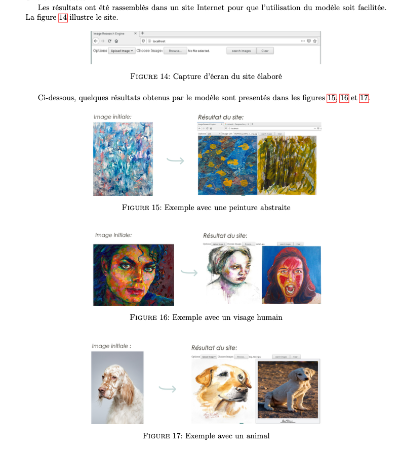

# Projet Navee

Nous avons implémenté un moteur de recherche d'images inversée, c'est-à-dire que pour une image donnée, l'algorithme renvoie les images les plus similaires qu'il possède dans la base de données.

Il est divisé en trois grandes parties :

- la gestion de la base de données,
- la formation au modèle
- un serveur web pour mettre le tout en place.

## Extrait du rapport inclus dans le repository

## Setup

Le dossier data gère la base de données et le fichier data.py contient les
principaux des fonctions pour travailler avec la base de données en sql.
 Le fichier `DataGen.py` sert à de créer un générateur de données keras pour
pouvoir gérer la base de données plus efficacement.

Dans le dossier feature_extractor, il contient les principaux fichiers pour la
entrainement création de notre modèle de feature extraction.
Dans le carnet Jupyter `Train_Classification_model.ipynb` détaille les étapes
de la création du modèle.

Dans le dossier web se trouve la page HTML créée.

Pour plus d'informations techniques sur les travaux, veuillez lire l'article
écrit dans le dossier 'article'.

Initialisez le serveur web : Le serveur web nommé `index.py` ne peut être que
initialisé si tous les prérequis qui se trouvent dans le fichier
`requirements.txt` sont satisfaits.

Si toutes les conditions sont remplies, l'initialisation du serveur web
il suffit d'exécuter le fichier setup.py pour que les fichiers nécessaires
sont telechargés (comme par exemple les poids des modèles) et il suffit ensuite
de utilisez la commande `python3 index.py` pour que le serveur se démarre
à l'adresse `localhost` à la porte `80`.
